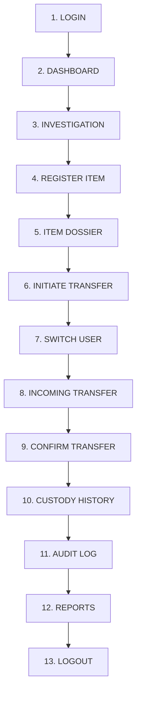

# ChainTrack — System Demonstration & Evaluation Guide

**ChainTrack** is an enterprise-grade Digital Chain-of-Custody Tracking System designed to enforce strict evidence integrity, role-based access control, custodial transitions, and immutable audit trails for internal forensic investigations.

This guide provides an end-to-end walkthrough for academic evaluations, live project demonstrations, and vivas.

---

## 1. System Requirements & Startup

### Step A: Ensure MySQL Database Is Running
ChainTrack uses MySQL (default port `3306`) with database `chaintrack`.
```powershell
# Verify MySQL Windows Service is running:
Get-Service -Name MySQL*, MariaDB*
# If stopped, start it via PowerShell (Run as Administrator):
Start-Service -Name MySQL80
```
*Note: Database credentials are configured in `config/database.php` (default user `root`, database `chaintrack`).*

### Step B: Start the PHP Development Server
From the project root directory:
```powershell
cd D:\path\to\chaintrack
php -S localhost:8000 -t .
```

### Step C: Access Application
Open your browser and navigate to:
**[http://localhost:8000/](http://localhost:8000/)**

---

## 2. Demonstration Accounts & Role Matrix

> [!NOTE]
> **DEMONSTRATION / DEVELOPMENT CREDENTIALS ONLY**  
> All accounts listed below are seeded demonstration profiles for academic evaluation.

All demonstration accounts use the common default password:  
**`Password@123`**

| Username | Role | Full Name | Primary Responsibilities |
| :--- | :--- | :--- | :--- |
| **`admin`** | **Administrator** | Administrator | System-wide governance, user management, department/location/category masters, full audit oversight. |
| **`reza.hartono`** | **Lead Investigator** | Reza Hartono | Case management, registering controlled evidence items, initiating custodial transfers. |
| **`deni.oviya.a`** | **Lead Investigator** | Deni Oviya A | Independent case management, evidence item registration, and investigation leadership. |
| **`budi.santoso`** | **Evidence Custodian** | Budi Santoso | Evidence vault control, reviewing incoming evidence, accepting/rejecting custody transfers. |
| **`chen.wei`** | **Forensic Analyst** | Chen Wei | Laboratory examination, analysis-state transfers, evidence processing. |
| **`sven.larsen`** | **Compliance Auditor** | Sven Larsen | Independent oversight, immutable audit trail verification, compliance report generation. |

---

## 3. Recommended 13-Stage Demonstration Sequence

Follow this sequential workflow to showcase complete lifecycle integrity without data anomalies:



### Stage 1: Login
- Navigate to `http://localhost:8000/`
- Enter Username: **`reza.hartono`** | Password: **`Password@123`**
- Click **Sign In to ChainTrack**.

### Stage 2: Dashboard Overview
- View the tailored **Lead Investigator Dashboard**.
- Observe real-time statistical metrics: Active Cases, Total Controlled Items, Pending Transfers, and Recent Activity.

### Stage 3: Investigation Case Management
- Click **Investigations** on the top navigation / sidebar (`/investigations/index.php`).
- Click on an existing case (e.g. *INV-2026-001 - Project Aegis Breach*) or click **+ New Investigation** to review case metadata, lead investigator assignment, and associated evidence list.

### Stage 4: Register Controlled Evidence Item
- Click **Controlled Items** -> **+ Register Item** (`/items/add_item.php`).
- Complete the registration:
  - **Item Name**: `Encrypted NVMe SSD - SN-9081`
  - **Category**: Select *Digital Evidence*
  - **Investigation**: Link to *INV-2026-001*
  - **Location**: Select *Evidence Locker A*
  - **Initial Custodian**: Automatically assigned to you (Reza Hartono)
  - **Physical Description**: `Samsung 990 Pro 2TB NVMe with forensic write-block seal.`
- Click **Register Item**.

### Stage 5: View Item Dossier & Initial Booking
- The system automatically loads the **Item Details Dossier** (`/items/item_details.php?id=...`).
- Verify:
  - Unique tracking reference code (e.g. `ITM-2026-0008`).
  - Current Custodian: **Reza Hartono**.
  - Current Location: **Evidence Locker A**.
  - Initial chain-of-custody booking event recorded under **Custody History Timeline**.

### Stage 6: Initiate Custody Transfer
- On the item dossier page, click **Initiate Transfer** (`/transfers/initiate.php?item_id=...`).
- Form entries:
  - **Recipient / To User**: Select **Budi Santoso** (Evidence Custodian).
  - **Destination Location**: Select **Evidence Vault Primary**.
  - **Reason for Transfer**: `Transferring sealed drive for long-term secure vault storage.`
- Click **Submit Transfer Request**.
- The item status updates to show pending transfer dispatch.

### Stage 7: Logout & Login as Receiving User
- Click user avatar/name on top right -> **Sign Out**.
- Sign in as the recipient:
  - Username: **`budi.santoso`** | Password: **`Password@123`**

### Stage 8: Review Incoming Transfer
- On Budi Santoso's dashboard, notice the **Pending Incoming Transfers** alert badge.
- Click **Transfers** -> **Incoming Transfers** (`/transfers/incoming.php`).
- Locate the transfer initiated by Reza Hartono.
- Click **Review / Confirm** (`/transfers/confirm.php?id=...`).

### Stage 9: Confirm Custody Transfer
- Review sender identity, source location, item barcode/reference, and timestamp.
- Enter Confirmation Remarks: `Drive received intact with tamper-evident seal verified unbroken.`
- Click **Accept & Confirm Custody Transfer**.
- The database transaction atomicaly:
  1. Sets transfer status to `confirmed`.
  2. Updates item `current_custodian_id` to Budi Santoso.
  3. Updates item `current_location_id` to Evidence Vault Primary.
  4. Appends a permanent record to `custody_history`.
  5. Records an immutable system `audit_logs` entry.

### Stage 10: Verify Custody History Continuity
- From the confirmation screen or item catalog, open the item dossier (`/items/item_details.php?id=...`).
- Inspect the **Custody History** timeline:
  - Event 1: Initial Booking (`Reza Hartono`).
  - Event 2: Transfer Confirmed (`Reza Hartono -> Budi Santoso`, remarks and timestamps intact).

### Stage 11: Verify System Audit Trail
- Sign out and sign in as **`admin`** or **`sven.larsen`** (Compliance Auditor).
- Click **Audit Logs** (`/audit/index.php`).
- Review the comprehensive chronological audit log verifying event types:
  - `user.login`
  - `item.create`
  - `custody.transfer_initiated`
  - `custody.transfer_confirmed`
- Observe recorded IP addresses, user IDs, and detailed contextual descriptions.

### Stage 12: Generate & Inspect Reports
- Click **Reports** (`/reports/index.php`).
- Switch between analytic tabs:
  - **Custody Activity Report**: Real-time custodial movement statistics.
  - **Item Inventory by Category**: Physical distribution breakdown.
  - **Investigation Status Summary**: Evidence workload per active case.
  - **Overdue / Inactive Items**: Compliance risk monitoring.
- Test export / print functionality via browser print stylesheet (`Ctrl + P`).

### Stage 13: Clean Logout
- Click **Sign Out** to securely terminate session.
- System redirects cleanly back to the authentication screen without session leaks or redirect loops.

---

## 4. Standalone Demonstration Scenario: Operation Silent Trace (Inspector Deni Oviya A)

ChainTrack features a dedicated independent investigative scenario specifically configured for evaluation:

- **Lead Investigator**: Inspector Deni Oviya A  
  **Credentials**: `deni.oviya.a` / `Password@123`  
  **Department**: Criminal Investigation Division (CID)
- **Active Case**: `INV-2026-004` — **Operation Silent Trace**  
  *Scope*: Investigation involving suspected unauthorized access and digital evidence collection from a compromised workstation.
- **Evidence Inventory**:
  1. **Laptop Computer** (`EVD-2026-00028`) — Windows workstation recovered from Terminal Room 3B (Serial: `ST-WS-2026-001`).
  2. **USB Storage Device** (`EVD-2026-00029`) — Encrypted flash drive collected from incident desk (Serial: `ST-USB-2026-002`).
  3. **Mobile Phone** (`EVD-2026-00030`) — Secured smartphone collected from incident desk drawer (Serial: `ST-MOB-2026-003`).
- **Pre-Configured Custody Transfer**:
  - **Item**: Laptop Computer (`EVD-2026-00028`).
  - **Transfer Chain**: Inspector Deni Oviya A ➔ Custodian Budi Santoso (`budi.santoso`).
  - **Destination**: Vault 2 -- Digital & Electronics (`C-VAULT-2`).
  - **Reason**: *"Forensic examination and secure evidence processing."*
  - **Status**: `Confirmed` — Full chronological custody and status histories recorded.
  - **Dashboard Effect**: Deni holds 2 items in personal custody (USB & Mobile Phone) while retaining investigative oversight over all 3 case evidence items.

---

## 5. Architectural & Security Highlights for Viva

1. **Lightweight Diagnostic Utility**: Run `php tools/diagnostics.php` at any time to demonstrate database schema health, zero orphaned foreign keys, and 100% sequential chain-of-custody continuity.
2. **Atomic Transfers**: Custody handoffs are wrapped in database transactions preventing desynchronization between current custody and historical logs.
3. **Defense-in-Depth RBAC**: Both client-facing UI menus and server-side controller entry points enforce strict role permissions (`requireRole()`).
4. **Session Hardening**: Sessions enforce HTTP-only, strict same-site cookies, dynamic inactivity timeout, and regeneration upon privilege elevation.
5. **No Blind Trust**: Non-existent entities, unauthenticated probes, and tampered POST payloads result in graceful sanitization, flash notifications, and controlled redirects.
